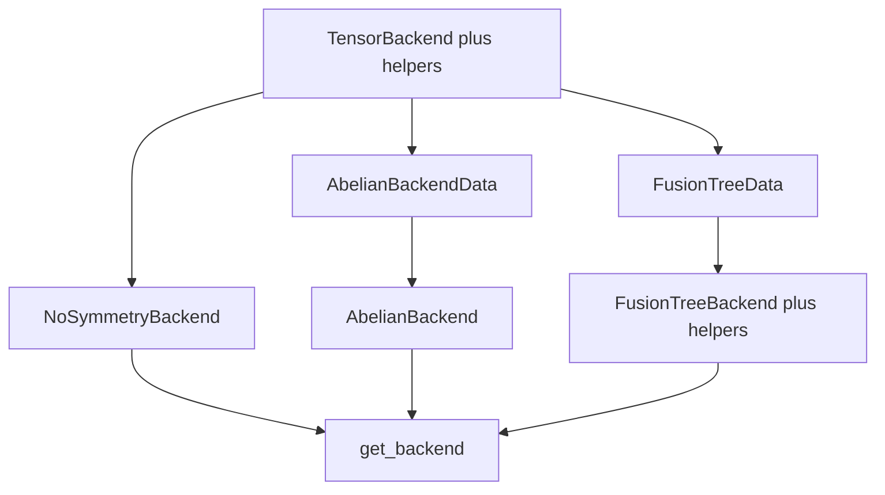

# Layer 3 — Tensor backends conversion

## Status

**In progress** on branch `convert_backends`.

Done so far (exported from `cyten._core`, **not** monkey-patched into `cyten.backends` yet):

- `TensorBackend` + `conventional_leg_order` + `get_same_backend` — [convert_TensorBackend.md](convert_TensorBackend.md)
- `NoSymmetryBackend` — [convert_NoSymmetryBackend.md](convert_NoSymmetryBackend.md)
- `AbelianBackendData` — [convert_AbelianBackendData.md](convert_AbelianBackendData.md)
- `AbelianBackend` + `valid_block_inds` — [convert_AbelianBackend.md](convert_AbelianBackend.md)
- `FusionTreeData` — [convert_FusionTreeData.md](convert_FusionTreeData.md)
- `get_backend` (C++ NoSymmetry + Abelian; Python fusion_tree) — [convert_get_backend.md](convert_get_backend.md)

Still Python (full backends):

- `FusionTreeBackend` (+ helpers) — [convert_FusionTreeBackend.md](convert_FusionTreeBackend.md)

## Conversion order



| Order | Object(s) | Python source | Notes |
| --- | --- | --- | --- |
| 1 | `TensorBackend`, `conventional_leg_order`, `get_same_backend` | `cyten/backends/_backend.py` | Skip `HasBackend` Protocol |
| 2 | `NoSymmetryBackend` | `cyten/backends/no_symmetry.py` | Smallest concrete backend |
| 3 | `AbelianBackendData` then `AbelianBackend` (+ `_valid_block_inds`) | `cyten/backends/abelian.py` | |
| 4 | `FusionTreeData` then `FusionTreeBackend` (+ Instruction/Mapping helpers as needed) | `cyten/backends/fusion_tree_backend.py` | Largest; may split headers |
| 5 | `get_backend` | `cyten/backends/backend_factory.py` | |

Wire public imports via `cyten/backends/__init__.py` only after the relevant C++ types are green.

## File layout

| Kind | Path |
| --- | --- |
| Header | `include/cyten/backends/tensor_backend.h` (then `no_symmetry.h`, `abelian.h`, `fusion_tree_backend.h`, …) |
| Source | `src/backends/tensor_backend.cpp` (+ register in `src/CMakeLists.txt`) |
| Bindings | `pybind/backends/py_tensor_backend.cpp` |
| Trampoline | `pybind/backends/py_trampolines.hpp` |
| Optional umbrella | `include/cyten/backends.h` (later) |

## Design decisions

### `Data` / `DiagonalData` / `MaskData`

- Nested abstract `TensorBackend::Data` (`enable_shared_from_this`, `DataPtr` / `DataCPtr`), analogous to `BlockBackend::Block`.
- Concrete backends own concrete data types inheriting that base (`AbelianBackendData`, `FusionTreeData`; NoSymmetry uses a thin `Data` holding `BlockBackend::BlockPtr`).
- On the abstract API, `Data` / `DiagonalData` / `MaskData` all map to `DataPtr`.

### Tensor circular dependency (Layer 4 not ready)

- Map `SymmetricTensor` / `DiagonalTensor` / `Mask` → `py::object` interim in declarations and `pybind11_codegen.toml`.
- Keep C++ types for: `BlockBackend`, `Block`, `Scalar`, `Dtype`, spaces, `Symmetry`, `FusionTree`, `Sector`.
- Callables → `py::function` until a clearer C++ callback typedef is justified.
- When Layer 4 lands, replace `py::object` tensor args with real C++ tensor types.

### Trampoline + monkey-patch timing

- Generate trampoline so Python subclasses can remain until converted.
- **Do not monkey-patch** `TensorBackend` into `cyten.backends` until concrete backends are C++ (or trampoline inheritance is proven). Export as `cyten._core.TensorBackend` for intermediate work.
- Keep original Python `_backend.py` until the layer’s backends are converted and pytest is green.

## Codegen

Use micromamba Python (system Python lacks `ast_comments`):

```bash
/opt/micromamba/envs/cyten_py314/bin/python .cursor/skills/pybind11-codegen/pybind11_codegen.py <cmd> ...
```

## Dependencies

- Layer 1: `BlockBackend`, `NumpyBlockBackend`, `Block`, `Scalar`, `Dtype` — done.
- Layer 2: symmetries, trees, spaces — largely done / monkey-patched.
- Layer 4 tensors — still Python; backends reach them via `py::object` for now.
