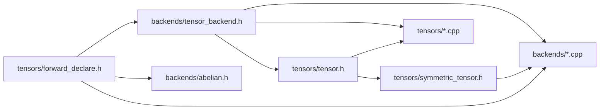

# Backend `py::object` → typed tensor API cleanup

## metadata

- status: **done**
- primary header: `include/cyten/backends/tensor_backend.h`
- forward decls: `include/cyten/tensors/forward_declare.h` (new)
- related: [convert_tensors.md](convert_tensors.md) §15

## Goal

Replace interim `py::object` tensor arguments on `TensorBackend` (and concrete backends) with typed
`Tensor::Ptr` / `SymmetricTensor::Ptr` / `DiagonalTensor::Ptr` / `Mask::Ptr` (and `CPtr` where
read-only), so backend implementations use C++ members (`tensor->data`, `tensor->codomain`, …)
instead of `.attr(...)`.

A former py-object bridge on tensor classes existed for that interim API: call sites cast
`shared_from_this()` to `py::object` so backends could take duck-typed Python tensors. Once
backends take typed pointers; the bridge was removed (use thin `py::cast(shared_from_this())`
only where Python interop is still required).

## Why circular includes block a naïve change

Today:

```text
tensor.h / symmetric_tensor.h / …
    → #include <cyten/backends/tensor_backend.h>
         (and often abelian.h / fusion_tree_backend.h / no_symmetry.h)

tensor_backend.h
    → must NOT #include complete tensor headers
         (would cycle: backends → tensors → backends)
    → currently uses py::object for all tensor args
```

If `tensor_backend.h` included `symmetric_tensor.h` for `SymmetricTensor::Ptr`, that header pulls
`tensor_backend.h` again → incomplete types / ODR / compile failures.

## How `forward_declare.h` breaks the cycle

Add **`include/cyten/tensors/forward_declare.h`** with only incomplete types + aliases, e.g.:

```cpp
#pragma once
#include <memory>

namespace cyten {

class Tensor;
class SymmetricTensor;
class DiagonalTensor;
class Identity;
class Mask;
class ChargedTensor;

using TensorPtr = std::shared_ptr<Tensor>;
using TensorCPtr = std::shared_ptr<const Tensor>;
// … same for SymmetricTensor, DiagonalTensor, Mask, ChargedTensor

} // namespace cyten
```

Rules:

| Translation unit | May include |
| --- | --- |
| `tensor_backend.h`, `abelian.h`, `fusion_tree_backend.h`, `no_symmetry.h` | **`forward_declare.h` only** for tensor types — typed virtual signatures, no member access |
| `tensor.h` / subclass headers | `tensor_backend.h` as today (complete `TensorBackend`) |
| Backend `.cpp` files (`abelian.cpp`, …) | **Complete** tensor headers (`symmetric_tensor.h`, `mask.h`, …) — safe: `.cpp` is not included by tensor headers |
| Tensor `.cpp` files | Complete backend + tensor headers as today |

Include graph after the change:



Key point: **headers** only see incomplete tensor types via `forward_declare.h`. **Backend `.cpp`**
sees complete types and can touch members. No cycle.

`py::cast(TensorPtr)` / `py::isinstance<SymmetricTensor>` in `.cpp` also need complete types; that
is fine once backend `.cpp` includes the real headers.

## What stays `py::object`

Do **not** force-type these (Python / HDF5 / ad-hoc maps):

- HDF5 load/save (`hdf5_saver`, `h5gr`, paths)
- `dtype_map` and similar callback/dict kwargs
- Sector arrays / numpy-ish blobs already typed elsewhere as `SectorArray` / `Block`
- Grid cells in `from_grid` until a typed grid API exists (optional later)
- `DataCls` (Python type object for `isinstance` checks) — keep as `py::object`

## Signature migration pattern

Example:

```cpp
// before
virtual DataPtr dagger(py::object a) = 0;
virtual DataPtr compose(py::object a, py::object b) = 0;

// after
virtual DataPtr dagger(TensorCPtr a) = 0;
virtual DataPtr compose(TensorCPtr a, TensorCPtr b) = 0;
```

Use the **most specific** type the method documents (`MaskCPtr` for mask ops, `DiagonalTensorCPtr`
for diagonal elementwise, etc.). Prefer `CPtr` for read-only inputs.

Pybind trampolines / bindings: accept `Tensor::Ptr` (pybind converts Python tensor subclasses).
Where a method still needs to accept both C++ and leftover Python objects, keep a thin overload or
`py::object` entry only at the binding layer — prefer not on the C++ virtual.

## Dropped py-object bridge helper

| Today | After |
| --- | --- |
| `backend->dagger(<py bridge>)` | `backend->dagger(shared_from_this())` / `static_pointer_cast<…>(…)` |
| `backend->test_tensor_sanity(<py bridge>, …)` | `backend->test_tensor_sanity(…Ptr…)` |
| `get_same_backend({ <py bridge>, other })` | typed `get_same_backend` overload or pass `Ptr`s |

Removed the virtual py-object bridge from `SymmetricTensor` / `DiagonalTensor` / `Identity` / `Mask` /
`ChargedTensor`. For rare Python interop inside tensor `.cpp`, use
`py::cast(std::static_pointer_cast<Tensor>(shared_from_this()))` locally instead of a member.

## Implementation strategy (avoid a 900-`.attr` big-bang)

Mechanical rewrite of every `.attr` in backend bodies is error-prone. Prefer **incremental**:

1. **Scaffold**
   - Add `forward_declare.h`.
   - Include it from `tensor_backend.h` (and concrete backend headers as needed).
   - Update the comment in `tensor_backend.h` (remove “interim until Layer 4”).

2. **Pilot one method end-to-end** (e.g. `dagger` or `norm`)
   - Change virtual + all overrides + pybind + call sites.
   - In the matching `.cpp`, `#include` complete tensor headers and replace `.attr("data")` etc. with
     members for that method only.
   - Prove compile + targeted pytest.

3. **Batch by backend surface**
   - Diagonal-only APIs → `DiagonalTensor(C)Ptr`
   - Mask APIs → `Mask(C)Ptr`
   - Generic algebra (`compose`, `outer`, `inner`, …) → `Tensor(C)Ptr` / `SymmetricTensor(C)Ptr`
   - After each batch: rebuild + `pytest` for the touched free functions / classes.

4. **Rewrite backend bodies as types land**
   - Prefer `a->data`, `a->codomain`, `a->dtype`, `dynamic_pointer_cast<SymmetricTensor>(a)`.
   - Keep `.attr` only for genuinely Python-only fields if any remain.

5. **Delete the py-object bridge** when unused; run not-slow pytest.

6. **Docs**
   - Mark §15 done in `convert_tensors.md`; keep this file as the record.

## Risks / notes

- **Incomplete type in headers:** never call methods or `sizeof` on forward-declared tensors in
  headers; only store/pass `shared_ptr`.
- **Trampolines:** `PYBIND11_OVERRIDE` for backend methods must use the new Ptr types.
- **`get_same_backend` / `conventional_leg_order`:** add typed overloads; keep `py::object`
  overloads temporarily if free functions still pass Python objects, then delete.
- **ChargedTensor:** often unwraps to `invariant_part` (`SymmetricTensor`); typed APIs may take
  `TensorCPtr` and branch with `dynamic_pointer_cast`.

## Checklist

- [x] Add `include/cyten/tensors/forward_declare.h`
- [x] Wire into `tensor_backend.h` (+ concrete backend headers)
- [x] Pilot one virtual (typed signature + `.cpp` member access + call sites)
- [x] Migrate diagonal / mask / algebra / decomposition batches
- [x] Remove py-object bridge helper and dead pybind helpers
- [x] Update `convert_tensors.md` §15 status; not-slow pytest green
