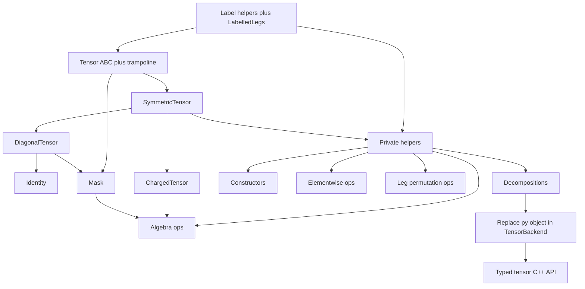

# Layer 4 — Tensors conversion (`_tensors.py`)

## Status

Branch: **`convert_tensors`** (reuse for the whole module; no per-object branches).

Python source: [`cyten/tensors/_tensors.py`](../../cyten/tensors/_tensors.py) — thin `_core` re-export (class + free-function bodies removed).

Layer 3 backends use typed tensor Ptr args via [`forward_declare.h`](../../include/cyten/tensors/forward_declare.h) — see [convert_tensor_backend_cleanup.md](convert_tensor_backend_cleanup.md).

Layer 4 C++ tensor / space / leg API is typed — see [convert_tensor_typed_api.md](convert_tensor_typed_api.md).

## Conversion order



| # | Object(s) | Status |
| --- | --- | --- |
| 1–2 | Label helpers + `LabelledLegs` | **C++ + bindings**; helpers monkey-patched; Python `LabelledLegs` kept — [convert_LabelledLegs.md](convert_LabelledLegs.md) |
| 3 | `Tensor` ABC + trampoline | **C++ + bindings + trampoline + monkey-patched** — [convert_Tensor.md](convert_Tensor.md) |
| 4 | `SymmetricTensor` | **C++ + bindings + trampoline + monkey-patched** — [convert_SymmetricTensor.md](convert_SymmetricTensor.md) |
| 5 | `DiagonalTensor` | **C++ + bindings + trampoline + monkey-patched** — [convert_DiagonalTensor.md](convert_DiagonalTensor.md) |
| 6 | `Identity` | **C++ + bindings + monkey-patched** (no trampoline) — [convert_Identity.md](convert_Identity.md) |
| 7 | `Mask` | **C++ + bindings + monkey-patched** (no trampoline) — [convert_Mask.md](convert_Mask.md) |
| 8 | `ChargedTensor` | **C++ + bindings + monkey-patched** (no trampoline) — [convert_ChargedTensor.md](convert_ChargedTensor.md) |
| 9 | Private helpers (`_check_compatible_legs`, `_compose_*`, `_convert_*`, `_decomposition_*`, `_svd_new_labels`) | **C++ + bindings + monkey-patched** — [convert_tensor_helpers.md](convert_tensor_helpers.md) |
| 10 | Constructors (`eye`, `tensor`, `add_trivial_leg`, `zero_like`, `tensor_from_grid`) | **C++ + bindings + monkey-patched** — [convert_tensor_constructors.md](convert_tensor_constructors.md) |
| 11 | Elementwise ops (`angle`, `cutoff_inverse`, `complex_conj`, `imag`, `real`, `real_if_close`, `sqrt`, `stable_log`) | **C++ + bindings + monkey-patched** — [convert_tensor_elementwise.md](convert_tensor_elementwise.md) |
| 12 | Algebra ops (`almost_equal`, `compose`, `dagger`, `inner`, `item`, `linear_combination`, `norm`, `outer`, `partial_compose`, `partial_trace`, `pinv`, `scalar_multiply`, `scale_axis`, `tdot`, `trace`, `transpose`, `is_scalar`, `get_same_device`, `on_device`) | **C++ + bindings + monkey-patched** — [convert_tensor_algebra.md](convert_tensor_algebra.md) |
| 13 | Leg permutation ops (`bend_legs`, `check_same_legs`, `combine_legs`, `combine_to_matrix`, `move_leg`, `permute_legs`, `split_legs`, `squeeze_legs`) | **C++ + bindings + monkey-patched** — [convert_tensor_legs.md](convert_tensor_legs.md) |
| 14 | Decompositions (`eigh`, `entropy`, `qr`, `lq`, `svd`, `svd_apply_mask`, `truncate_singular_values`, `truncated_svd`, `apply_mask_DiagonalTensor`) | **C++ + bindings + monkey-patched** — [convert_tensor_decompositions.md](convert_tensor_decompositions.md) |
| 15 | Backend `py::object` cleanup | **done** — [convert_tensor_backend_cleanup.md](convert_tensor_backend_cleanup.md) (`forward_declare.h`; typed virtuals; `as_py_object` removed) |
| 16 | Monkey-patch Tensor hierarchy + remaining free fns (`apply_mask`, `enlarge_leg`, `exp`) | **done**; Python bodies removed (`_tensors.py` is `_core` re-export); not-slow pytest passed |
| 17 | Typed tensor C++ API (drop leftover `py::object`) | **done** — [convert_tensor_typed_api.md](convert_tensor_typed_api.md) (`TensorProduct::factors` as `Leg::Ptr`; typed ctors / helpers / free fns) |

## Backend `py::object` cleanup

**Done** — see **[convert_tensor_backend_cleanup.md](convert_tensor_backend_cleanup.md)**.

- `forward_declare.h` breaks the backends ↔ tensors include cycle.
- `TensorBackend` / concrete backends / trampolines take `TensorCPtr` /
  `SymmetricTensorCPtr` / `DiagonalTensorCPtr` / `MaskCPtr`.
- Backend `.cpp` files include complete tensor headers; helpers use members (`data`, `dtype`, …).
- `as_py_object()` removed; call sites pass typed `shared_from_this()` / casts.
- HDF5 / `dtype_map` / `DataCls` remain `py::object`.

## Typed tensor C++ API

**Done** — see **[convert_tensor_typed_api.md](convert_tensor_typed_api.md)**.

- `TensorProduct::factors` is `std::vector<Leg::Ptr>` (no nested products stored as factors).
- Tensor / subclass factories and `_init_parse_*` take `TensorProduct::Ptr` / `Leg::Ptr` /
  `BlockPtr`; py-object ctors removed from the C++ API.
- `as_SymmetricTensor` returns `SymmetricTensor::Ptr`; `legs()` / `get_leg` / `charge_leg`
  return `Leg::Ptr`.
- Helpers and free functions take `Tensor(C)Ptr` / `Mask(C)Ptr` / `LegRef` / `LegLabels`.
  Sequence-of-spaces, nested labels, numpy blocks, and `*args` stay in pybind.
- HDF5, `py::function` factories, and numpy-facing methods remain `py::object`.

## File layout

```
include/cyten/tensors.h
include/cyten/tensors/
  labels.h              # constants + label helpers + LabelledLegs
  tensor.h
  symmetric_tensor.h
  diagonal_tensor.h     # DiagonalTensor + Identity
  mask.h
  charged_tensor.h
  helpers.h
  constructors.h
  ops_elementwise.h
  ops_algebra.h
  ops_legs.h
  decompositions.h
src/tensors/            # matching .cpp; register in src/CMakeLists.txt
pybind/tensors/         # matching py_*.cpp; register in pybind/CMakeLists.txt
```

Namespace: `cyten::`.

## Design notes

- Label type: `std::optional<std::string>` (`None` ↔ empty optional).
- Label lists: `std::vector<std::optional<std::string>>`.
- `LabelledLegs` holder: `py::smart_holder` (subclasses will use `shared_ptr` / inheritance).
- Do **not** port `_elementwise_function` decorator; emit overloads later.
- `_dual_label_list` is not listed by codegen; convert manually with the other label helpers.
- `duplicate_entries` remains Python for now; implement a small C++ helper in `labels.cpp` (or inline) for `LabelledLegs`.

## Codegen

```bash
/opt/micromamba/envs/cyten_py314/bin/python .cursor/skills/pybind11-codegen/pybind11_codegen.py <cmd> ...
```
