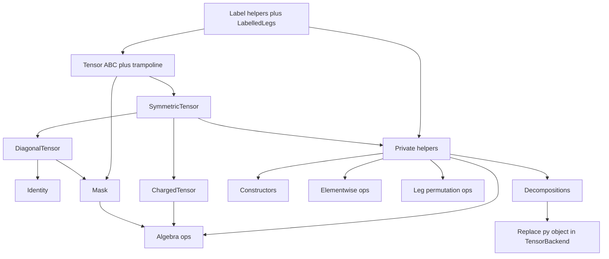

# Layer 4 — Tensors conversion (`_tensors.py`)

## Status

Branch: **`convert_tensors`** (reuse for the whole module; no per-object branches).

Python source: [`cyten/tensors/_tensors.py`](../../cyten/tensors/_tensors.py) (~7500 lines).

Layer 3 backends still take tensor args as interim `py::object` in [`tensor_backend.h`](../../include/cyten/backends/tensor_backend.h). Typed cleanup is **deferred** (circular includes / scale of `.attr` rewrite); see [Backend `py::object` cleanup](#backend-pyobject-cleanup-deferred) below.

## Conversion order



| # | Object(s) | Status |
| --- | --- | --- |
| 1–2 | Label helpers + `LabelledLegs` | **C++ + bindings**; helpers monkey-patched; Python `LabelledLegs` kept — [convert_LabelledLegs.md](convert_LabelledLegs.md) |
| 3 | `Tensor` ABC + trampoline | **C++ + bindings + trampoline + monkey-patched** — [convert_Tensor.md](convert_Tensor.md) |
| 4 | `SymmetricTensor` | **C++ + bindings + trampoline + monkey-patched** — [convert_SymmetricTensor.md](convert_SymmetricTensor.md) |
| 5 | `DiagonalTensor` | **C++ + bindings + trampoline + monkey-patched** — [convert_DiagonalTensor.md](convert_DiagonalTensor.md) |
| 6 | `Identity` | **C++ + bindings + monkey-patched** (no trampoline) — [convert_Identity.md](convert_Identity.md) |
| 7 | `Mask` | **C++ + bindings + monkey-patched** (no trampoline) — [convert_Mask.md](convert_Mask.md) |
| 8 | `ChargedTensor` | **C++ + bindings + monkey-patched** (no trampoline) — [convert_ChargedTensor.md](convert_ChargedTensor.md) |
| 9 | Private helpers (`_check_compatible_legs`, `_compose_*`, `_convert_*`, `_decomposition_*`, `_svd_new_labels`) | **C++ + bindings + monkey-patched** — [convert_tensor_helpers.md](convert_tensor_helpers.md) |
| 10 | Constructors (`eye`, `tensor`, `add_trivial_leg`, `zero_like`, `tensor_from_grid`) | **C++ + bindings + monkey-patched** — [convert_tensor_constructors.md](convert_tensor_constructors.md) |
| 11 | Elementwise ops (`angle`, `cutoff_inverse`, `complex_conj`, `imag`, `real`, `real_if_close`, `sqrt`, `stable_log`) | **C++ + bindings + monkey-patched** — [convert_tensor_elementwise.md](convert_tensor_elementwise.md) |
| 12 | Algebra ops (`almost_equal`, `compose`, `dagger`, `inner`, `item`, `linear_combination`, `norm`, `outer`, `partial_compose`, `partial_trace`, `pinv`, `scalar_multiply`, `scale_axis`, `tdot`, `trace`, `transpose`, `is_scalar`, `get_same_device`, `on_device`) | **C++ + bindings + monkey-patched** — [convert_tensor_algebra.md](convert_tensor_algebra.md) |
| 13 | Leg permutation ops (`bend_legs`, `check_same_legs`, `combine_legs`, `combine_to_matrix`, `move_leg`, `permute_legs`, `split_legs`, `squeeze_legs`) | **C++ + bindings + monkey-patched** — [convert_tensor_legs.md](convert_tensor_legs.md) |
| 14 | Decompositions (`eigh`, `entropy`, `qr`, `lq`, `svd`, `svd_apply_mask`, `truncate_singular_values`, `truncated_svd`, `apply_mask_DiagonalTensor`) | **C++ + bindings + monkey-patched** — [convert_tensor_decompositions.md](convert_tensor_decompositions.md) |
| 15 | Backend `py::object` cleanup | **deferred** — see below |
| 16 | Monkey-patch Tensor hierarchy + remaining free fns (`apply_mask`, `enlarge_leg`, `exp`) | **done**; not-slow pytest stepwise passed |

## Backend `py::object` cleanup (deferred)

Attempted replacing `TensorBackend` tensor `py::object` args with `TensorPtr` / `MaskPtr` / `DiagonalTensorPtr`. Blocked by:

1. Circular includes: tensor headers include backends; backends cannot include complete tensor types in headers (fwd decls only).
2. `py::cast(TensorPtr)` in backend `.cpp` needs complete types; including tensor headers pulls backends again and is workable in `.cpp`, but a mechanical body rewrite (`py::object` → Ptr while keeping `.attr` access) is error-prone at this scale (~900 `.attr` uses).

Done in the monkey-patch wrap-up instead:

1. Port + monkey-patch `apply_mask`, `enlarge_leg`, `exp`.
2. Monkey-patch full Tensor hierarchy (`LabelledLegs` … `ChargedTensor`).
3. `data_as_python` / `make_python_*` pass `DataPtr` into C++ ctors (no NoSymmetry unwrap into ctor).
4. Pytest stepwise; fix failures.

Follow-up for typed backend API:

1. Add `include/cyten/tensors/fwd.h` and typed virtuals on `TensorBackend`.
2. In backend `.cpp` only: `#include` complete tensor headers; access `tensor->data` / `codomain` / etc. (prefer members over `.attr`).
3. Update `as_py_object()` call sites to pass `shared_from_this()` / `static_pointer_cast`.
4. Keep HDF5 / `dtype_map` / sector arrays as `py::object`.

## File layout

```
include/cyten/tensors.h
include/cyten/tensors/
  labels.h              # constants + label helpers + LabelledLegs
  tensor.h
  symmetric_tensor.h
  diagonal_tensor.h     # DiagonalTensor + Identity
  mask.h
  charged_tensor.h
  helpers.h
  constructors.h
  ops_elementwise.h
  ops_algebra.h
  ops_legs.h
  decompositions.h
src/tensors/            # matching .cpp; register in src/CMakeLists.txt
pybind/tensors/         # matching py_*.cpp; register in pybind/CMakeLists.txt
```

Namespace: `cyten::`.

## Design notes

- Label type: `std::optional<std::string>` (`None` ↔ empty optional).
- Label lists: `std::vector<std::optional<std::string>>`.
- `LabelledLegs` holder: `py::smart_holder` (subclasses will use `shared_ptr` / inheritance).
- Do **not** port `_elementwise_function` decorator; emit overloads later.
- `_dual_label_list` is not listed by codegen; convert manually with the other label helpers.
- `duplicate_entries` remains Python for now; implement a small C++ helper in `labels.cpp` (or inline) for `LabelledLegs`.

## Codegen

```bash
/opt/micromamba/envs/cyten_py314/bin/python .cursor/skills/pybind11-codegen/pybind11_codegen.py <cmd> ...
```
