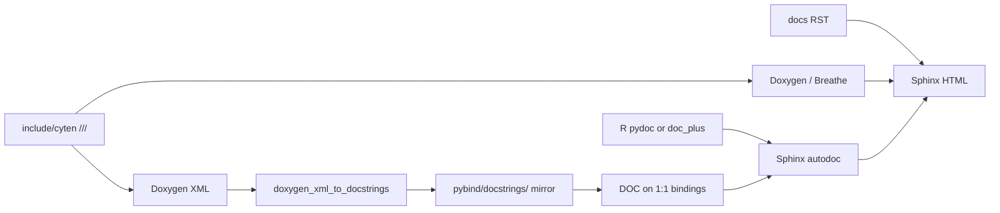

# Porting docstrings (dual-language docs)

Policy summary for documenting the C++ core and the pybind11 Python surface.
Background: [tenpy/cyten#242](https://github.com/tenpy/cyten/issues/242).
Reference implementation (pilot): tensor algebra —
[`include/cyten/tensors/ops_algebra.h`](../../include/cyten/tensors/ops_algebra.h),
[`pybind/tensors/py_ops_algebra.cpp`](../../pybind/tensors/py_ops_algebra.cpp),
[`pybind/docstrings/tensors/ops_algebra.h`](../../pybind/docstrings/tensors/ops_algebra.h).

## Goals

- Most near-term users read **Python** docs (Sphinx autodoc + Napoleon).
- A pure C++ / libcyten future needs **header** docs (Doxygen + Breathe).
- Do **not** try to generate C++ comments from `R"pydoc"`, or treat docstring
  generation as the only documentation pipeline.

## Three layers

| Layer | Source of truth | Audience | Tooling |
| --- | --- | --- | --- |
| Concepts / how-to | [`docs/`](../) RST (language-neutral) | Everyone | Sphinx |
| Shared API semantics | `///` on [`include/cyten/`](../../include/cyten/) | C++ + future libcyten | Doxygen / Breathe |
| Python surface | pybind `DOC(...)` and/or `R"pydoc"` | `import cyten` / TeNPy | autodoc + Napoleon |



## What goes where

### Header `///` (shared meaning)

Write **NumPy-style / reST inside `///`**, with **C++ types only**.

Include:

- What the function/class does (first paragraph = brief).
- Invariants, domain/codomain rules, “may return a scalar”, algorithms.
- `Parameters` / `Returns` using C++ names (`TensorCPtr`, `LegRef`,
  `std::optional<std::map<std::string, std::string>>`, `nullopt`, …).

Avoid:

- Doxygen `\param` / `\return` if you want Napoleon NumPy sections in Python
  `__doc__` (prefer NumPy underlines in `///`; the generator copies those
  comments verbatim from the header).
- Python-only types and conventions (`None`, `dict`, `int or str` labels,
  `py::object`, `*args`).
- Sphinx roles that only make sense for Python autodoc when they would confuse
  a C++-only library long-term. Prefer plain ``TypeName`` in backticks for types
  in headers when possible. Short `:ref:` / diagrams that already live in the
  user guide can stay in **Python** docs instead.

Example (`compose`):

```cpp
/// Tensor contraction as map composition. Requires ``tensor1.domain == tensor2.codomain``.
///
/// If both tensors have no remaining open legs, returns a scalar.
///
/// Parameters
/// ----------
/// tensor1, tensor2 : TensorCPtr
///     Maps to compose: ``tensor1`` after ``tensor2``.
/// relabel1, relabel2 : std::optional<std::map<std::string, std::string>>
///     Optional label maps. ``nullopt`` means no relabel.
///
/// Returns
/// -------
/// std::variant<TensorPtr, BlockBackend::Scalar>
///     The composed tensor, or a scalar if no open legs remain.
```

### pybind (Python surface)

| Binding style | Docstring |
| --- | --- |
| Direct `&free_function` / `&Class::method` with the **same meaning** as C++ | Prefer `DOC(cyten, …)` from the generated docstring header |
| Overloads | Use the overload suffix (`DOC(cyten, inner, 2)` for the second declaration in the header) |
| Lambdas / wrappers (`py::object`, label parsing, `None` defaults, `*args`) | Keep hand-written `R"pydoc(...)"` |
| Shared C++ meaning + Python-only args | `doc_plus(DOC(cyten, name), R"pydoc(…)")` — see [`pybind/doc_plus.h`](../../pybind/doc_plus.h) |

Do **not** attach `DOC(...)` to a Python helper that does not call the C++
symbol (e.g. duck-typed `is_scalar` in algebra bindings).

Python-only extras in `R"pydoc"` / `doc_plus` appendices:

- `None` defaults, `dict` label maps, `int or str` legs.
- Sphinx roles (`:class:`, `:meth:`, `:ref:`), NumPy examples, diagrams.
- Behavior that exists only in the wrapper.

Indent `R"pydoc(` content with the surrounding `.def()` block; put `)pydoc"` on
its own line at the same indent.

### RST user guide

Language-neutral concepts and tutorials. Prefer Python examples for now; C++
snippets can be added later in separate tabs/sections. Do not assume readers
open the C++ API pages.

## Docstring generation (optional regeneration)

### Layout

| C++ header | Generated / checked-in docstring header |
| --- | --- |
| `include/cyten/<rel>` | `pybind/docstrings/<rel>` |

Example: `include/cyten/tensors/ops_algebra.h` →
`pybind/docstrings/tensors/ops_algebra.h`.

Each binding `.cpp` includes **only** the docstring headers it needs:

```cpp
#include "docstrings/tensors/ops_algebra.h"
```

That keeps rebuilds local: changing one include’s comments does not invalidate
unrelated `py_*.cpp` TUs.

### Checklist when porting a header

1. Write / clean `///` on the public C++ API (NumPy style, C++ types).
2. Add `<rel>` to `CYTEN_MKDOC_HEADERS` in top-level [`CMakeLists.txt`](../../CMakeLists.txt).
3. Regenerate (or create) `pybind/docstrings/<rel>` and **commit it**.
4. In the matching `pybind/.../py_*.cpp`:
   - `#include "docstrings/<rel>"`
   - Replace 1:1 `R"pydoc"` with `DOC(cyten, …)` where safe.
   - Leave lambdas as `R"pydoc"`; use `doc_plus` when appending Python-only sections.
5. Confirm overload suffixes after the first generation (`DOC(cyten, foo, 2)`, …).
6. Spot-check `obj.__doc__` in Python for a direct binding and a wrapper.

### Regenerating

Requires **doxygen** (see [`docs/environment.yml`](../environment.yml); optional in the
main env). Normal builds and CI leave generation **OFF** and use checked-in files.

```bash
cmake -S . -B build -DCYTEN_GENERATE_DOCSTRINGS=ON
cmake --build build --target cyten_generate_docstrings
```

Pipeline:

1. Scoped Doxygen XML for each header in `CYTEN_MKDOC_HEADERS`.
2. [`scripts/doxygen_xml_to_docstrings.py`](../../scripts/doxygen_xml_to_docstrings.py)
   maps symbols from XML (names, namespaces, overload order) and copies `///`
   comment bodies from the source header into `DOC()` macros.

Notes:

- Default is `-DCYTEN_GENERATE_DOCSTRINGS=OFF`; `_core` does **not** depend on
  the generation target (a failed regen cannot break the extension build).
- Stamps live in the build tree so `ninja clean` does not delete checked-in files.
- Alias target `cyten_mkdoc_docstrings` still exists for older docs/scripts.

### Commit discipline

Always commit updated `pybind/docstrings/<rel>` together with the `///` / binding
changes that produced them, so CI and users without doxygen still build and see
correct `__doc__`.

## What not to do

- Do not dump full Python NumPy docs into headers (pollutes libcyten / Breathe).
- Do not generate C++ comments from `R"pydoc"`.
- Do not put C++ signature docs alone on a lambda whose Python signature differs
  (`LegRef` vs `int | str`, `optional<map>` vs `dict | None`).
- Do not rely on `\param` if you want TeNPy-style Napoleon sections in `DOC()`.
- Do not make `_core` depend on regenerating docstring headers at build time.
- Do not make `_core` depend on one giant docstring header for the whole tree.

## Status

| Area | State |
| --- | --- |
| Algebra free functions (`ops_algebra.h`) | Pilot: headers + `DOC` / `doc_plus` / lambdas |
| Other modules | Still mostly hand-written `R"pydoc"` from conversion; migrate incrementally via `CYTEN_MKDOC_HEADERS` |

Near term remains **Python-first**: full user-facing NumPy docs stay available
through pybind; headers carry shared semantics (and briefs at minimum). When a
Python-free libcyten is real, invert only the shared layer (headers canonical for
meaning; generated `DOC()` for 1:1 bindings; wrappers keep extra `R"pydoc"`).
