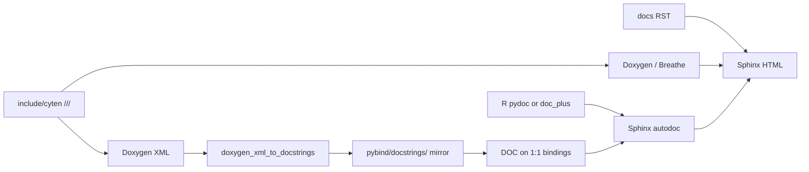

# Porting docstrings (dual-language docs)

Policy summary for documenting the C++ core and the pybind11 Python surface.
Background: [tenpy/cyten#242](https://github.com/tenpy/cyten/issues/242).
Reference implementation (pilot): tensor algebra —
[`include/cyten/tensors/ops_algebra.h`](../../include/cyten/tensors/ops_algebra.h),
[`pybind/tensors/py_ops_algebra.cpp`](../../pybind/tensors/py_ops_algebra.cpp),
[`pybind/docstrings/tensors/ops_algebra.h`](../../pybind/docstrings/tensors/ops_algebra.h).

## Goals

- Most near-term users read **Python** docs (Sphinx autodoc + Napoleon).
- A pure C++ / libcyten future needs **header** docs (Doxygen + Breathe).
- Do **not** try to generate C++ comments from `R"pydoc"`, or treat docstring
  generation as the only documentation pipeline.

## Three layers

| Layer | Source of truth | Audience | Tooling |
| --- | --- | --- | --- |
| Concepts / how-to | [`docs/`](../) RST (language-neutral) | Everyone | Sphinx |
| Shared API semantics | `///` on [`include/cyten/`](../../include/cyten/) | C++ + future libcyten | Doxygen / Breathe |
| Python surface | pybind `DOC(...)` and/or `R"pydoc"` | `import cyten` / TeNPy | autodoc + Napoleon |



## What goes where

### Header `///` (shared meaning)

Write **Doxygen markup with markdown** in `///` comments. Types come from the
C++ signature — do **not** repeat parameter/return types in the comments.

Include:

- What the function/class does (first paragraph = brief).
- Invariants, domain/codomain rules, “may return a scalar”, algorithms.
- `@param` / `@returns` describing meaning only (not types).
- Markdown for emphasis and code (`*italic*`, `` `code` ``).

Avoid:

- Restating parameter or return types in `@param` / `@returns` (redundant with
  the declaration; clutters Breathe).
- NumPy ``Parameters`` / ``----------`` sections in headers — Doxygen’s markdown
  treats those as headings and collapses the body into one paragraph (broken
  C++ / Breathe pages). Prefer `@param` / `@returns`; the docstring generator
  converts them to NumPy for Python `DOC()`.
- Python-only types and conventions (`None`, `dict`, `int or str` labels,
  `py::object`, `*args`).
- Sphinx roles that only make sense for Python autodoc when they would confuse
  a C++-only library long-term. Prefer markdown `` `name` `` for identifiers.
  Short `:ref:` / diagrams that already live in the user guide can stay in
  **Python** docs instead.

Example (`compose`):

```cpp
/// Tensor contraction as map composition. Requires `tensor1.domain == tensor2.codomain`.
///
/// If both tensors have no remaining open legs, returns a scalar.
///
/// @param tensor1,tensor2 Maps to compose: `tensor1` after `tensor2`.
/// @param relabel1,relabel2 Optional label maps applied before composition.
///     `nullopt` means no relabel.
/// @returns The composed tensor, or a scalar if no open legs remain.
```

### pybind (Python surface)

| Binding style | Docstring |
| --- | --- |
| Direct `&free_function` / `&Class::method` with the **same meaning** as C++ | Prefer `DOC(cyten, …)` from the generated docstring header (auto ``cyten-cpp-ref`` marker → ``[C++]`` badge) |
| Overloads | Use the overload suffix (`DOC(cyten, inner, 2)` for the second declaration in the header) |
| Lambdas / wrappers that still wrap a C++ API | `doc_cpp_ref(R"pydoc(…)", "cyten::name()")` — see [`pybind/doc_plus.h`](../../pybind/doc_plus.h) |
| Shared C++ meaning + Python-only args | `doc_plus(DOC(cyten, name), R"pydoc(…)")` (Python extras are inserted *before* the auto marker) |
| Python-only helpers (no matching C++ symbol) | Hand-written `R"pydoc"` only — **no** `DOC` / `doc_cpp_ref` |

Do **not** attach `DOC(...)` or `doc_cpp_ref` to a Python helper that does not
call the documented C++ symbol (e.g. duck-typed `is_scalar` in algebra bindings).

#### Cross-links to C++ (``[C++]`` badge)

Generated `DOC()` strings end with a machine marker for Sphinx
([`docs/sphinx/cyten_cpp_link.py`](../sphinx/cyten_cpp_link.py)):

```text
.. cyten-cpp-ref:: cyten::dagger
```

Overloads use the bare name (Sphinx indexes one ``cpp:function`` entry per
symbol), e.g. ``.. cyten-cpp-ref:: cyten::inner``.
The HTML docs show a compact ``[C++]`` link after the signature (next to
``[source]``); the marker may still appear in interactive ``help()`` /
``__doc__``.

For explicit control (wrappers, override target):

```cpp
doc_cpp_ref(R"pydoc(Brief.)pydoc", "cyten::apply_mask()");  // () stripped
doc_cpp_ref(DOC(cyten, inner, 2), "cyten::inner");
```

The C++ symbol must appear on a `docs/cpp/…` Breathe page or the badge will not
resolve. Do not put Sphinx roles or this marker in header `///`.

Python-only extras in `R"pydoc"` / `doc_plus` appendices:

- `None` defaults, `dict` label maps, `int or str` legs.
- Sphinx roles (`:class:`, `:meth:`, `:ref:`), NumPy examples, diagrams.
- Behavior that exists only in the wrapper.

Indent `R"pydoc(` content with the surrounding `.def()` block; put `)pydoc"` on
its own line at the same indent.

### RST user guide

Language-neutral concepts and tutorials. Prefer Python examples for now; C++
snippets can be added later in separate tabs/sections. Do not assume readers
open the C++ API pages.

### C++ API pages (`docs/cpp/…`, Breathe)

Free functions are pulled in with ``.. doxygenfunction::``. For **overloads**,
Breathe cannot resolve a bare name — list each signature explicitly (parameter
types only is enough), same pattern as [`docs/cpp/config.rst`](../cpp/config.rst):

```rst
.. doxygenfunction:: cyten::inner(TensorCPtr, TensorCPtr, bool)
   :project: cyten

.. doxygenfunction:: cyten::inner(VectorLikeCPtr, VectorLikeCPtr, bool)
   :project: cyten
```

Otherwise Sphinx emits *Unable to resolve function … with arguments None* and
shows the candidate overloads. Match types to the Doxygen XML / header
(east-const style like ``BlockBackend::Scalar const &`` when that is what
appears there). See the pilot page
[`docs/cpp/tensors/ops_algebra.rst`](../cpp/tensors/ops_algebra.rst).

## Docstring generation (always at build)

### Layout

| C++ header | Generated docstring header (gitignored) |
| --- | --- |
| `include/cyten/<rel>` | `pybind/docstrings/<rel>` |

Example: `include/cyten/tensors/ops_algebra.h` →
`pybind/docstrings/tensors/ops_algebra.h`.

Headers are written under `pybind/docstrings/` so IDEs can open them next to the
bindings; they are **not** committed (see [`.gitignore`](../../.gitignore)).
**doxygen** is a required build dependency ([`environment.yml`](../../environment.yml)).

Each binding `.cpp` includes **only** the docstring headers it needs:

```cpp
#include "docstrings/tensors/ops_algebra.h"
```

That keeps rebuilds local: changing one include’s comments does not invalidate
unrelated `py_*.cpp` TUs.

### Checklist when porting a header

1. Write / clean `///` on the public C++ API (Doxygen `@param` / `@returns` +
   markdown; no parameter/return types in the comments).
2. Add `<rel>` to `CYTEN_MKDOC_HEADERS` in top-level [`CMakeLists.txt`](../../CMakeLists.txt).
3. Build (or `cmake --build <build-dir> --target cyten_generate_docstrings`) so
   `pybind/docstrings/<rel>` appears; do **not** commit it.
4. In the matching `pybind/.../py_*.cpp`:
   - `#include "docstrings/<rel>"`
   - Replace 1:1 `R"pydoc"` with `DOC(cyten, …)` where safe.
   - Leave lambdas as `R"pydoc"`; use `doc_plus` when appending Python-only sections.
5. Confirm overload suffixes after the first generation (`DOC(cyten, foo, 2)`, …).
6. If the header has overloads, update the matching `docs/cpp/…/*.rst` so each
   `doxygenfunction` includes a distinguishing parameter list (see above).
7. Spot-check `obj.__doc__` in Python for a direct binding and a wrapper.

### How generation works

Every `_core` build runs target `cyten_generate_docstrings`:

1. Scoped Doxygen XML for each header in `CYTEN_MKDOC_HEADERS`.
2. [`scripts/doxygen_xml_to_docstrings.py`](../../scripts/doxygen_xml_to_docstrings.py)
   maps symbols from XML (names, namespaces, overload order), reads `///`
   comment bodies from the source header, converts `@param` / `@returns` to
   NumPy sections, and appends a ``.. cyten-cpp-ref::`` marker for the Sphinx
   ``[C++]`` badge.

```bash
cmake --build <build-dir> --target cyten_generate_docstrings
```

Alias target `cyten_mkdoc_docstrings` still exists for older docs/scripts.

## What not to do

- Do not dump full Python NumPy docs into headers (pollutes libcyten / Breathe;
  Doxygen also mangles NumPy `Parameters` / `Returns` underlines).
- Do not restate parameter/return types in header `@param` / `@returns`.
- Do not generate C++ comments from `R"pydoc"`.
- Do not put C++ signature docs alone on a lambda whose Python signature differs
  (`LegRef` vs `int | str`, `optional<map>` vs `dict | None`).
- Do not commit generated `pybind/docstrings/**/*.h` files.
- Do not make `_core` depend on one giant docstring header for the whole tree.
- Do not use a bare `.. doxygenfunction:: cyten::name` when `name` is overloaded
  (Breathe needs the argument types).

## Status

| Area | State |
| --- | --- |
| Algebra free functions (`ops_algebra.h`) | Pilot: headers + `DOC` / `doc_plus` / lambdas |
| Other modules | Still mostly hand-written `R"pydoc"` from conversion; migrate incrementally via `CYTEN_MKDOC_HEADERS` |

Near term remains **Python-first**: full user-facing NumPy docs stay available
through pybind; headers carry shared semantics (and briefs at minimum). When a
Python-free libcyten is real, invert only the shared layer (headers canonical for
meaning; generated `DOC()` for 1:1 bindings; wrappers keep extra `R"pydoc"`).
